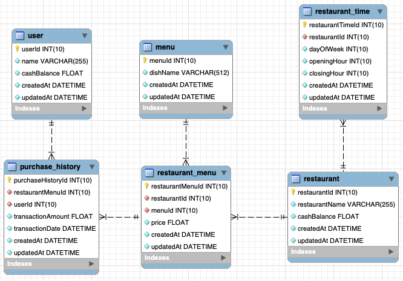

# Backend Buying Frenzy

A backend service and a database for a food delivery platform.

This service supports the following API endpoints:

1. List all restaurants that are open at a certain datetime
2. List top y restaurants that have more or less than x number of dishes within a price range, ranked alphabetically
3. Search for restaurants or dishes by name, ranked by relevance to search term
4. Process a user purchasing a dish from a restaurant

### Initial Setup

- Clone the repo to your local machine

  ```
  git clone https://github.com/huggingbot/backend-buying-frenzy.git
  ```

- Create `.env` file in root directory of repo then copy contents of `.env.example` to `.env`

  ```
  cp .env.example .env
  ```

- Install dependencies and run a local MySQL docker container

  ```
  yarn && yarn setup
  ```

- Run the ETL process

  ```
  yarn db:etl
  ```

- Compile model and migration files, recreate, migrate and seed database

  ```
  yarn db:reset
  ```

### Development

```
yarn start
```

### Production

```
yarn build && yarn serve
```

### Unit Testing with Coverage

```
yarn test
```

### API Documentations

```
http://localhost:3010/api-docs/
```

### ERD


